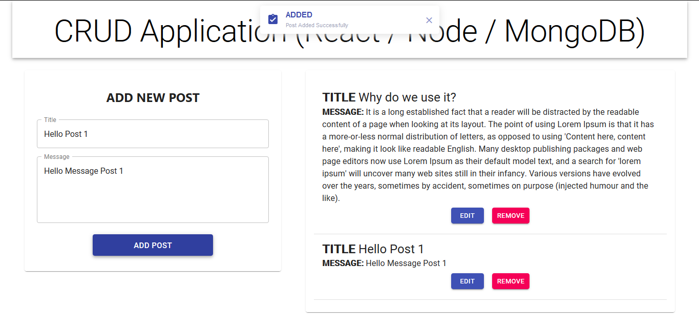

# MERN_Stack_CRUD_App
CRUD App created using Express / React / Node / MongoDB

# PROJECT SETUP COMMANDS 

# 1) Install MongoDB locally

https://www.mongodb.com/download-center/community (according to your OS)

# 2) Packages Install For Node APIs Application

install in mern_stack_api Folder

Install Node_modules:
npm install

1) npm i express => web framework for node
2) npm i mongoose => Mongoose is a MongoDB object modeling tool designed to work in an asynchronous environment. Mongoose supports both promises and callbacks
3) npm i body-parser => Node.js body parsing middleware.Parse incoming request bodies in a middleware before your handlers, available under the req.body property.
4) npm i cors => CORS is a node.js package for providing a Connect/Express middleware that can be used to enable CORS with various options.
5) npm i nodemon (Install globally) => nodemon is a tool that helps develop node.js based applications by automatically restarting the node application when file changes in the directory are detected.

Installing all packages in single command:
npm i -s express mongoose body-parser cors

Installing Package Globally:
npm i -g nodemon

# 3) Packages Install For ReactJS Application

Install in react_crud_node Folder

Install Node_modules:
npm install

1) npm i redux
2) npm i react-redux 
3) npm i redux-thunk
4) npm i axios => For APIs Use
5) npm i @material-ui/core
6) npm i @material-ui/icons
7) npm i -s butter-toast

Install in single command:
npm i -s redux react-redux redux-thunk
npm i -s @material-ui/core @material-ui/icons

# Application Structure

● src
+---● actions
|   |
|   |-- api.js (handle all http request)
|   |-- postMessage.js (Redux actions & action creators) 
|   |-- store.js (configure redux store)
|
+---● components
|   |
|   |--PostMessageForm.js (form operations) - child
|   |--PostMessages.js  (list of records) - parent
|   |--useForm.js (handles common form opearations)
|
|---● reducers
|   |
|   |--postMessage.js
|   |--index.js
|
|-- App.js
|-- index.js
|-- index.css
